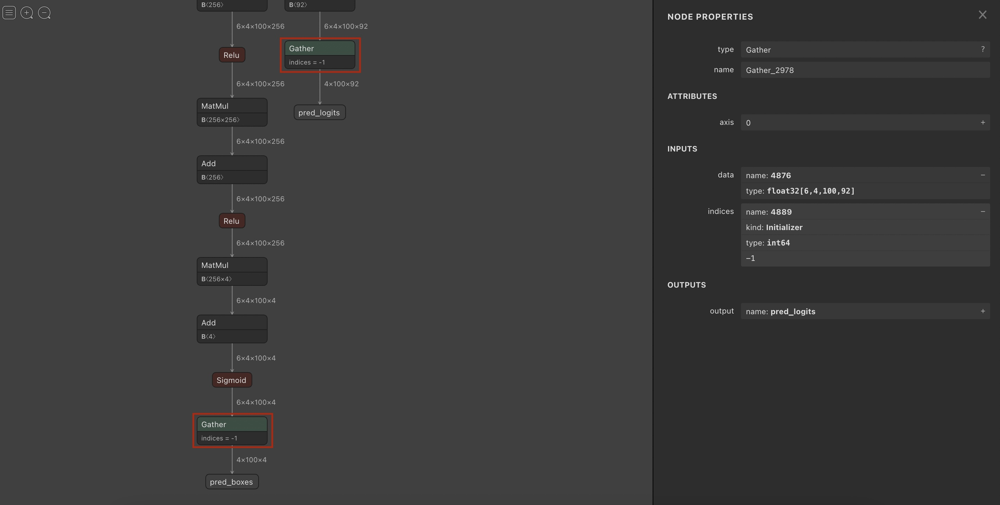
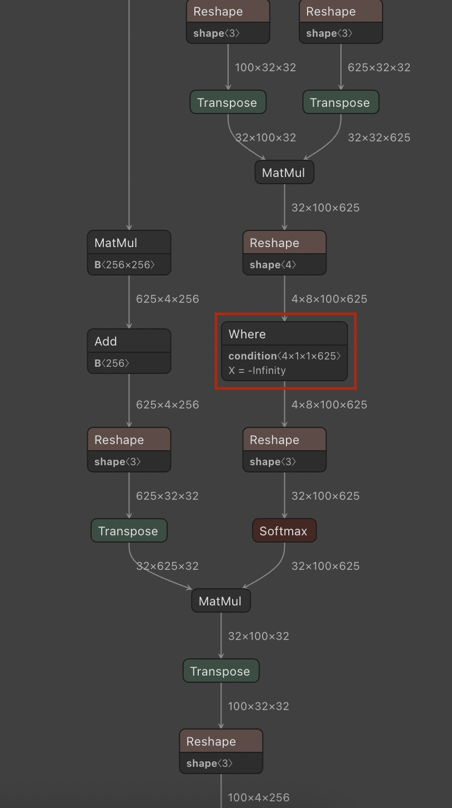
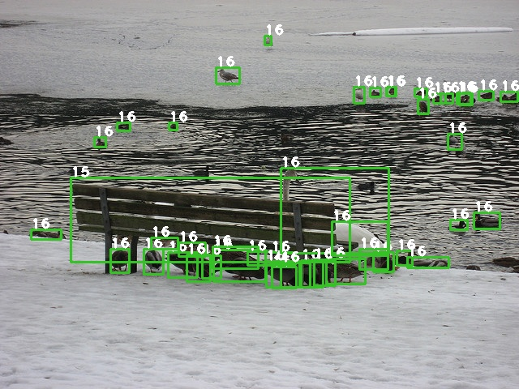

# DETR Pytorch - ONNX - TensorRT
Pytorch [DETR](https://github.com/facebookresearch/detr) 모델을 ONNX를 통해 TensorRT 엔진으로 변환
  
## Experimental environments
* Pytorch==1.8.1
* ONNX==1.10.1
* TensorRT==8.0.1
  
## Pytorch to ONNX
[DETR](https://github.com/facebookresearch/detr) 공식 repo.에서 제공하는 COCO pretrained weights 사용
  
```bash
git clone https://github.com/wj1224/detr_tensorrt.git

cd detr_tensorrt/python

wget https://dl.fbaipublicfiles.com/detr/detr-r50-e632da11.pth -P checkpoints

python onnx_exporter.py
```
  
onnx_exporter.py는 pytorch 모델을 onnx 모델로 변환하고, 변환된 onnx 모델의 불필요한 연산자들을 합병하여 간소화.
  
> __onnx 모델 변환 시 주의점__  
>   
> onnx 모델을 그대로 TensorRT 엔진으로 변환할 시 각 아웃풋 브랜치의 마지막 gather 레이어의 출력이 0으로 나오는 이슈가 있음.  
onnx-graphsurgeon 라이브러리를 통해 마지막 gather 레이어의 index 지정을 -1에서 5로 변경해 주면 문제가 해결됨.
  

  
```python
""" onnx_exporter.py """
node_configs = [(2711, 2713), # batch-size 1
        (2978, 2980)] # batch-size 4
""" 
Neutron 등의 툴을 통해 확인 한 onnx모델 gather 레이어의 레이어 번호를 node_configs에 입력,
batch size에 따라 달라짐 
""" 
    if batch_size == 4:
        node_number = node_configs[1]
    else:
        node_number = node_configs[0]

    graph = gs.import_onnx(onnx.load(sim_path))
    for node in graph.nodes:
        if node.name == f"Gather_{node_number[0]}":
            print(node.inputs[1])
            node.inputs[1].values = np.int64(5)
            print(node.inputs[1])
        elif node.name == f"Gather_{node_number[1]}":
            print(node.inputs[1])
            node.inputs[1].values = np.int64(5)
            print(node.inputs[1])
```
  
output/detr_resnet50_sim_changed.onnx 파일이 TensorRT 엔진 변환에 사용할 onnx 모델.
  
## ONNX to TensorRT
build
```bash
cd tensorrt/src

mkdir build

cd build

cmake ..

make -j `cat /proc/cpuinfo | grep cores | wc -l`
```
  
FP32
```bash
./onnx_trt_convert -x ../../../python/output/detr_resnet50_sim_changed.onnx -e ./detr_resnet50_fp32.engine
```
  
FP16
```bash
./onnx_trt_convert -x ../../../python/output/detr_resnet50_sim_changed.onnx -e ./detr_resnet50_fp16.engine -p 0
```
  
INT8
> INT8 변환시 TensorRT는 boolean 연산자에 대한 변환을 지원하지 않음. 따라서 ONNX 모델의 where 연산자가 미지원되어 정상적인 변환이 되지 않는 이슈가 있음.  
> 해당 연산은 MHA 레이어의 attention mask 연산으로 인해 발생.   
> PTQ가 아닌 QAT를 사용하거나, 추가적인 플러그인을 통해 where 연산자를 재구현하여 이슈를 해결해야 할 것으로 보임
  

  
## Inference
### run  
```bash
./detect -m DATA_PATH -t OUTPUT_PATH -e detr_resnet50_fp16.engine
```
  
### results
  
  

  
### inference speed
  
|Geforce GTX 1080Ti|Pytorch</br>(batch-size 1)|Pytorch</br>(batch-size 4)|TensorRT</br>(batch-size 1|TensorRT</br>(batch-size 4|
|:---:|:---:|:---:|:---:|:---:|
|FP32|42ms|125ms|25ms|96ms|
|FP16|41ms|114ms|25ms|95ms|
|INT8|-|-|-|-|
  
|Titan RTX|Pytorch</br>(batch-size 1)|Pytorch</br>(batch-size 4)|TensorRT</br>(batch-size 1|TensorRT</br>(batch-size 4|
|:---:|:---:|:---:|:---:|:---:|
|FP32|29ms|86ms|20ms|70ms|
|FP16|23ms|49ms|11ms|39ms|
|INT8|-|-|-|-|
  
> Geforce GTX 1080Ti의 경우 Pascal 아키텍쳐로, Tensor core를 지원하지 않아 FP16 추론시에도 큰 속도 차이가 없음.
  
## References
[1] [DETR Official Repo.](https://github.com/facebookresearch/detr)  
[2] [TensorRT-DETR](https://github.com/DataXujing/TensorRT-DETR)  
[3] [TensorRTx](https://github.com/wang-xinyu/tensorrtx)